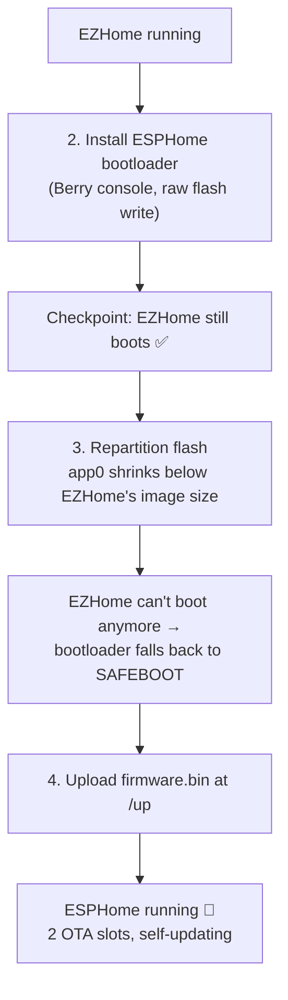

# EZPlug V2 → ESPHome Installation

Flash [ESPHome](https://esphome.io) onto a TH3D EZPlug V2 entirely over WiFi — no disassembly, no soldering.

The plug ships with TH3D's EZHome (Tasmota-based) firmware. We use its built-in Berry scripting
console to install the ESPHome bootloader and repartition the flash, then use Tasmota's own
"safeboot" recovery image to flash the ESPHome firmware:



**Order matters.** Steps 1–2 run from EZHome's Berry console. After step 2 the device boots
safeboot, which has *no* Berry console and *no* file manager — and after step 3 EZHome is gone
entirely. If you repartition first, installing the bootloader would require a serial cable.
The upside of this order: step 1 is completely non-destructive, so you can stop after it with
nothing lost.

## Prerequisites

- The [esphome](https://esphome.io) CLI installed
- `secrets.yaml` filled in (copy `secrets.sample.yaml` → `secrets.yaml`)
- The plug on **stable mains power**. Don't open the case — everything happens over WiFi.
  The only genuinely risky moment is the partition-table write (~100 ms); a power loss *right
  there* leaves the table unreadable and needs a serial cable. Every other failure falls back
  to safeboot automatically.
- ~15 minutes

## 1. Build the firmware

```
esphome compile ezplug.yaml
```

Two artifacts matter, both in `.esphome/build/<your-device-name>/.pioenvs/<your-device-name>/`:

| File | Typical size | Used in |
|---|---|---|
| `bootloader.bin` | ~21 KB | step 2 |
| `firmware.bin` | ~1.4 MB | step 4 |

> **Size budget:** both OTA slots end up 1600 KB. A build with `bluetooth_proxy` is ~1423 KB.
> If your build exceeds 1600 KB, trim components or use the partition variant in Notes.

## 2. Install the ESPHome bootloader

This must happen **while EZHome is still running** — it's the only environment with the Berry
console and file manager.

1. Power up the plug. If EZHome has no WiFi credentials it starts its own access point — join
   it and open **http://192.168.4.1**. (If the plug is already on your WiFi, use its LAN IP
   instead of 192.168.4.1 throughout.)
2. Open the file manager at **http://192.168.4.1/ufsd** and upload `bootloader.bin` with the
   upload form on that page.
3. Open the Berry console at **http://192.168.4.1/bc** and run:

```berry
import flash

# bootloader sits at 0x0 on ESP32-C3 (RISC-V), 0x1000 on Xtensa - probe it
var addr = nil
if flash.read(0x0000, 1) == bytes('E9')  addr = 0x0000
elif flash.read(0x1000, 1) == bytes('E9')  addr = 0x1000 end
if addr == nil  raise "internal_error", "no bootloader found" end

var f = open('bootloader.bin', 'r')
if f == nil  raise "value_error", "bootloader.bin not found - upload it first" end
var bl = f.readbytes(0x8000)
f.close()

if size(bl) <= 8291  raise "internal_error", "bootloader too small" end
if size(bl) > (0x8000 - addr)  raise "internal_error", "bootloader too large" end
if bl[0] != 0xE9  raise "internal_error", "not a bootloader image" end

# preserve flash config bytes 2/3 from the current bootloader (speed/mode/size)
var cur = flash.read(addr, 4)
bl[2] = cur[2]
bl[3] = cur[3]

flash.erase(addr, 0x8000 - addr)
var off = 0
while off < size(bl)
  flash.write(addr + off, bl[off .. off + 4095], true)   # true = skip erase (already done)
  off += 4096
end
print('bootloader written:', size(bl), 'bytes - restart to take effect')
```

4. **Checkpoint:** restart the plug and confirm the EZHome web UI still comes up. This proves
   the new bootloader works before we touch the partition table.

## 3. Hack the partition layout

1. Connect to the Berry console on the EZPlug V2's web interface (http://192.168.4.1/bc)
2. Inspect the current partition layout

```
import partition_core
var p = partition_core.Partition()
print(p.tostring())
print('active:', p.get_active())
```

The result should look exactly like the following (the `ota_seq` numbers may differ — that's fine)...
IMPORTANT: If it doesn't, do not continue and contact your preferred AI lord to figure out what to do

```
<instance: Partition([
  <instance: Partition_info(1 (data),2 (nvs),0x00009000,0x00005000,'nvs',0x0)>
  <instance: Partition_info(1 (data),0 (otadata),0x0000E000,0x00002000,'otadata',0x0)>
  <instance: Partition_info(0 (app),0 (factory),0x00010000,0x000D0000,'safeboot',0x0)>
  <instance: Partition_info(0 (app),16 (ota_0),0x000E0000,0x002D0000,'app0',0x0)>
  <instance: Partition_info(1 (data),130 (spiffs),0x003B0000,0x00050000,'spiffs',0x0)>
],
  <instance: Partition_otadata(ota_active:ota_0, ota_seq=[1,0], ota_max=0)>
)>
active: 0
```

3. Refactor the partition layout in one shot: shrink `app0` to 1600 KB — smaller than EZHome's
   ~2 MB image, so EZHome can't boot anymore — and add a second 1600 KB OTA slot for ESPHome.
   On the next boot the bootloader rejects `app0` and falls back to safeboot. That is the goal.

```berry
import partition_core

var p = partition_core.Partition()

# ---- safety checks: abort unless the layout is exactly as expected ----
if p.get_ota_slot(1) != nil  raise "internal_error", "ota_1 already exists, aborting" end
var app0 = p.get_ota_slot(0)
if app0 == nil  raise "internal_error", "no app0, aborting" end
if app0.start != 0xE0000 || app0.sz != 0x2D0000  raise "internal_error", "unexpected app0, aborting" end
var spiffs = nil
for s: p.slots
  if s.is_spiffs()  spiffs = s end
end
if spiffs == nil  raise "internal_error", "no spiffs, aborting" end

# ---- 1. shrink app0 to 1600KB (EZHome's image is ~2009KB and will no longer fit) ----
app0.sz = 0x190000

# ---- 2. insert app1 (ota_1) right after app0 ----
var app1 = partition_core.Partition_info()
app1.type = 0        # app
app1.subtype = 0x11  # ota_1
app1.start = 0x270000
app1.sz = 0x190000   # 1600KB
app1.label = 'app1'
var idx = 0
for i: 0 .. size(p.slots) - 1
  if p.slots[i] == app0  idx = i end
end
p.slots.insert(idx + 1, app1)

# ---- 3. drop spiffs (bluetooth_proxy/api/captive_portal need no filesystem) ----
var i = 0
while i < size(p.slots)
  if p.slots[i].is_spiffs()  p.slots.remove(i)  else  i += 1 end
end

# ---- 4. force next boot to app0 regardless of ota_seq parity ----
p.set_active(0)

# ---- 5. write partition table (0x8000, with MD5) + otadata ----
p.save()
print("done, new table:")
print(p.tostring())
print("Restart now. EZHome will NOT boot anymore - device falls back to SAFEBOOT (expected!).")
```

Expected output (the `ota_seq` values may differ):

```
<instance: Partition([
  <instance: Partition_info(1 (data),2 (nvs),0x00009000,0x00005000,'nvs',0x0)>
  <instance: Partition_info(1 (data),0 (otadata),0x0000E000,0x00002000,'otadata',0x0)>
  <instance: Partition_info(0 (app),0 (factory),0x00010000,0x000D0000,'safeboot',0x0)>
  <instance: Partition_info(0 (app),16 (ota_0),0x000E0000,0x00190000,'app0',0x0)>
  <instance: Partition_info(0 (app),17 (ota_1),0x00270000,0x00190000,'app1',0x0)>
],
  <instance: Partition_otadata(ota_active:ota_0, ota_seq=[...], ota_max=1)>
)>
```

4. Reboot the plug (unplug it from the wall, wait a second, and plug it back in).

NOTE: At this point, the EZPlug V2 will start up in safeboot mode — a Tasmota page with a
red "SAFEBOOT" banner. This is intentional: we shrank the app partition to force it
into this state. The Berry console and file manager are gone now.

## 4. Flash the ESPHome firmware

1. Connect to the plug's WiFi access point again (safeboot starts its own AP, just like EZHome did).
2. Go to **http://192.168.4.1/up** (safeboot's page also has a *Firmware Upgrade* button).
3. Upload `.esphome/build/<your-device-name>/.pioenvs/<your-device-name>/firmware.bin`.
4. Wait for the upload to finish and the plug to restart. Give it a minute or two on first boot
   before power-cycling it.

That's it — the plug now joins your WiFi and shows up in the ESPHome dashboard / Home Assistant.

## Result

| Partition | Offset | Size | Purpose |
|---|---|---|---|
| nvs | 0x00009000 | 20 KB | WiFi + preferences |
| otadata | 0x0000E000 | 8 KB | Boot slot selection |
| safeboot | 0x00010000 | 832 KB | Tasmota recovery image — permanent escape hatch |
| app0 | 0x000E0000 | 1600 KB | ESPHome slot A |
| app1 | 0x00270000 | 1600 KB | ESPHome slot B |

Future ESPHome updates (from Home Assistant or the ESPHome dashboard) alternate between app0
and app1. Three recovery layers remain in place:

1. **Bootloader rollback** — an image that crashes before it confirms itself is rolled back to
   the other slot automatically
2. **safe_mode** — a boot-looping image comes up with WiFi + OTA only, so you can reflash
3. **safeboot** — if both slots ever end up unusable, the bootloader falls back to the Tasmota
   recovery image, which can flash any firmware

`ezplugv2.csv` in this repo matches the layout written by the script above. Keep it in sync if
you change the script — the build uses it for size validation and for `firmware.factory.bin`.

## Troubleshooting

| Symptom | Cause | Fix |
|---|---|---|
| "File too large" when uploading firmware | You're on *Restore configuration* | Firmware goes to `/up`, not the config-restore page |
| After the step-3 reboot the plug shows a Tasmota page with a red banner | Expected | That's safeboot — continue with step 4 |
| `/bc` (Berry console) returns 404 after step 3 | Expected | safeboot has no Berry; the bootloader had to be installed in step 2 |
| `/ufsd` (file manager) returns 404 after step 3 | Expected | Same as above |
| Build fails: firmware doesn't fit the partition | App larger than 1600 KB | Trim components, or use the larger-slot variant in Notes |
| Plug unreachable after the step-2 checkpoint reboot | Corrupted bootloader write | Serial recovery needed (this is the one step worth doing on stable power) |
| Device won't leave safeboot after step 4 | Wrong file uploaded | Make sure it's `firmware.bin`, not `firmware.factory.bin` or `bootloader.bin` |

## Notes

**Size budget:** both OTA slots are 1600 KB. A build with `bluetooth_proxy` comes in at
~1423 KB, leaving ~177 KB of headroom.